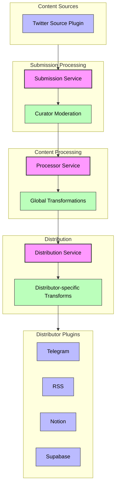

<!-- markdownlint-disable MD014 -->
<!-- markdownlint-disable MD033 -->
<!-- markdownlint-disable MD041 -->
<!-- markdownlint-disable MD029 -->

<div align="center">


<h1 style="font-size: 2.5rem; font-weight: bold;">curate.fun</h1>

  <p>
    <strong>curate news on socials & build community-owned autonomous brands</strong>
  </p>

  <p>
    <a href="https://docs.curate.fun" target="_blank"><strong>📚 Documentation</strong></a> •
    <a href="https://github.com/potlock/curatedotfun" target="_blank"><strong>💻 GitHub</strong></a> •
    <a href="https://x.com/curatedotfun" target="_blank"><strong>🐦 Twitter</strong></a> •
    <a href="https://t.me/+UM70lvMnofk3YTVh" target="_blank"><strong>💬 Telegram</strong></a>
  </p>

</div>

<details>
  <summary>Table of Contents</summary>

- [Getting Started](#getting-started)
  - [For Curators](#for-curators)
  - [For Developers](#for-developers)
- [System Architecture](#system-architecture)
  - [Content Flow Architecture](#content-flow-architecture)
  - [Key Components](#key-components)
  - [Monorepo Overview](#monorepo-overview)
- [Development](#development)
  - [Installing dependencies](#installing-dependencies)
  - [Running the app](#running-the-app)
  - [Building for production](#building-for-production)
  - [Deploying](#deploying)
  - [Running tests](#running-tests)
- [Configuration & Usage](#configuration--usage)
- [Contributing](#contributing)

</details>

## Getting Started

Choose your path to get started with curate.fun ⚡

### For Curators

If you want to submit and curate content:

1. 🎯 Head to the [User Guide](https://docs.curate.fun/docs/user-guides/curation)
2. 🔗 Learn how to submit content and moderate feeds
3. 🌟 Apply to become a curator for specific feeds

### For Developers

If you want to build and customize feeds:

1. 📖 Start with the [Configuration Guide](https://docs.curate.fun/docs/developers/configuration)
2. 🚀 Learn about [Deployment](https://docs.curate.fun/docs/developers/deployment)
3. 🔌 Explore [Plugin Development](https://docs.curate.fun/docs/developers/plugins)

## System Architecture

### Content Flow Architecture



### Key Components

- **[Frontend](./frontend/README.md)**
  - React-based web interface
  - Built with RSBuild and Tailwind CSS
  - Handles user interactions and submissions
  - See [Frontend README](./frontend/README.md) for detailed documentation

- **[Backend](./backend/README.md)**
  - Node.js runtime with Hono.js framework
  - Plugin-based architecture with module federation
  - Service-oriented design with clear boundaries
  - Twitter bot functionality
  - API endpoints for frontend
  - See [Backend README](./backend/README.md) for detailed documentation

### Monorepo Overview

This project uses a monorepo structure managed with [Turborepo](https://turbo.build/repo) for efficient build orchestration:

```bash
curatedotfun/
├── frontend/          # React frontend application (app.curate.fun)
├── backend/           # Node.js backend service (app.curate.fun)
├── package.json       # Root package.json for shared dependencies
└── turbo.json         # Turborepo configuration
```

## Development

### Installing dependencies

The monorepo uses npm for package management. Install all dependencies with:

```bash
npm install
```

This will install dependencies for all packages in the monorepo.

### Running the app

Make sure [Docker Desktop](https://www.docker.com/products/docker-desktop/) (or [Orbstack](https://orbstack.dev/) on MacOS) is running before starting the development servers.

Start both frontend and backend development servers:

```bash
pnpm run dev
```

This command:

- Starts a PostgreSQL container for development
- Initializes the database with migrations and seed data
- Starts the frontend and backend development servers
- Preserves your database data between runs

This will launch:

- Frontend at <http://localhost:5173>
- Backend at <http://localhost:3000>

For a fresh start with a clean database:

```bash
pnpm run dev:fresh
```

This command performs the same steps as `pnpm run dev` but removes any existing database volumes for a clean slate.

When you're done, press Ctrl+C (or Cmd+C on Mac) to stop all services. The command will automatically clean up Docker containers while preserving your database data (unless you used the `dev:fresh` command).

You can customize the development seed data by modifying `backend/scripts/seed-dev.ts`.

### Building for production

Build all packages:

```bash
npm run build
```

### Deploying

Start the application in production mode:

```bash
pnpm run start
```

For detailed deployment instructions, see our [Deployment Guide](https://docs.curate.fun/docs/developers/deployment).

### Running tests

```bash
pnpm run test
```

This command:

- Starts a dedicated PostgreSQL container for testing
- Initializes the test database with migrations and test seed data
- Runs the test suite
- Automatically cleans up all test containers and volumes when complete

Tests are located in the backend's `test` directory. Test seed data is located in `backend/test/setup/seed-test.ts`.

## Configuration & Usage

For detailed information about configuration, submission process, and usage, please refer to our documentation:

- [📚 Documentation Website](https://docs.curate.fun): Complete documentation
- [📖 Configuration Guide](https://docs.curate.fun/docs/developers/configuration): Feed setup, plugins, and system configuration
- [👥 User Guide](https://docs.curate.fun/docs/user-guides/curation): How to submit and moderate content
- [🛠️ Developer Guide](https://docs.curate.fun/docs/developers): Technical documentation for developers

## Contributing

Contributions are what make the open source community such an amazing place to learn, inspire, and create. Any contributions you make are **greatly appreciated**.

If you're interested in contributing to this project, please read the [contribution guide](./CONTRIBUTING.md).

<div align="right">
<a href="https://nearbuilders.org" target="_blank">

</a>
</div>
