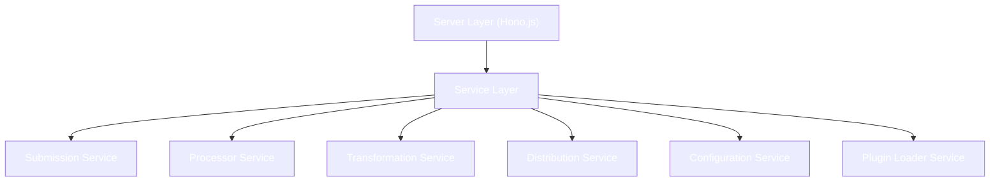

<!-- markdownlint-disable MD014 -->
<!-- markdownlint-disable MD033 -->
<!-- markdownlint-disable MD041 -->
<!-- markdownlint-disable MD029 -->

<div align="center">

<h1 style="font-size: 2.5rem; font-weight: bold;">curate.fun backend</h1>

  <p>
    <strong>Node.js/Hono.js backend service for the curate.fun platform</strong>
  </p>

</div>

<details>
  <summary>Table of Contents</summary>

- [Architecture Overview](#architecture-overview)
  - [Tech Stack](#tech-stack)
  - [Service Architecture](#service-architecture)
  - [Plugin System](#plugin-system)
- [Development](#development)
  - [Prerequisites](#prerequisites)
  - [Setup & Running](#setup--running)
  - [Testing](#testing)
- [Plugin Development](#plugin-development)

</details>

## Architecture Overview

### Tech Stack

- **Runtime**: Node.js with Bun for development
- **Framework**: Hono.js
- **Language**: TypeScript
- **Database**: File-based with DB service abstraction

### Service Architecture

The backend follows a service-oriented architecture with clear boundaries:



### Plugin System

The backend features a powerful plugin system with:

- Runtime module federation for dynamic loading
- Hot-reloading support
- Type-safe plugin configuration
- Custom endpoint registration
- Scheduled task integration

Supported plugin types:

- Source plugins (Twitter, Telegram, etc.)
- Transformer plugins (AI Transform, Simple Transform)
- Distributor plugins (Telegram, RSS, Notion, Supabase)

## Development

### Prerequisites

- [Bun](https://bun.sh) runtime installed (for development)
- Node.js 18+ (for production)
- Twitter API credentials (for content source)

### Setup & Running

1. Install dependencies:

```bash
bun install
```

2. Configure environment:

```bash
cp .env.example .env
```

3. Start development server:

Make sure [Docker Desktop](https://www.docker.com/products/docker-desktop/) (or [Orbstack](https://orbstack.dev/) on MacOS) is running before starting the development server.

```bash
# From the root directory
pnpm run dev
```

This command:

- Starts a PostgreSQL container for development
- Initializes the database with migrations and seed data
- Starts the backend server in watch mode
- Preserves your database data between runs

For a fresh start with a clean database:

```bash
# From the root directory
pnpm run dev:fresh
```

This command performs the same steps as `pnpm run dev` but removes any existing database volumes for a clean slate.

When you're done, press Ctrl+C (or Cmd+C on Mac) to stop all services. The command will automatically clean up Docker containers while preserving your database data (unless you used the `dev:fresh` command).

4. Modifying seed data:

Development seed data is located in `backend/scripts/seed-dev.ts`. You can modify this file to customize the initial data loaded into your development database.

5. Production deployment:

```bash
# From the root directory
pnpm run start
```

This command starts the application in production mode with a PostgreSQL database.

For detailed deployment instructions, see the [Deployment Guide](https://docs.curate.fun/docs/developers/deployment).

### Testing

Run the test suite:

```bash
# From the root directory
pnpm run test
```

This command:

- Starts a dedicated PostgreSQL container for testing
- Initializes the test database with migrations and test seed data
- Runs the test suite
- Automatically cleans up all test containers and volumes when complete

Test seed data is located in `backend/test/setup/seed-test.ts`. You can modify this file to customize the test data.

API documentation is available at `/swagger` when running the development server.

## Plugin Development

To develop new plugins for curate.fun, see the [Plugin Development Guide](https://docs.curate.fun/docs/plugins/build-plugin).

Plugins can extend the platform in various ways:

- Add new content sources
- Create custom transformations
- Implement new distribution channels

The plugin system provides a standardized interface with type safety and comprehensive testing support.

## Database Backup (Temporary)

AWS has been configured inside of the container, in order to take manual back-ups to Tigris object storage. These backups can be installed and replace .db/submissions.sqlite for local development, or for testing migration scripts.

1. SSH into container

```bash
fly ssh console
```

2. Export a backup, and then gzip it

```bash
litefs export -name db ./backups/MONTH-DAY
gzip ./backups MONTH-DAY
```

3. Save to S3 bucket (environment is preconfigured with S3 secrets)

```bash
aws s3 cp ./MONTH-DAY.gz s3://curatedotfun-backups/MONTH-DAY.gz --endpoint-url https://fly.storage.tigris.dev
```

4. Download from Tigris, unzip, and replace .db/submissions.sqlite

<div align="right">
<a href="https://nearbuilders.org" target="_blank">

</a>
</div>
