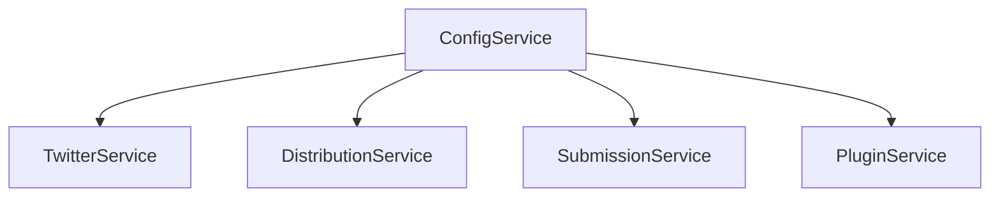
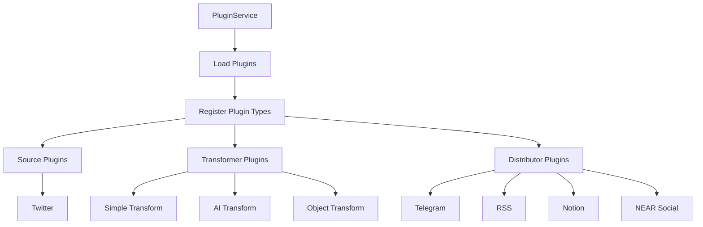
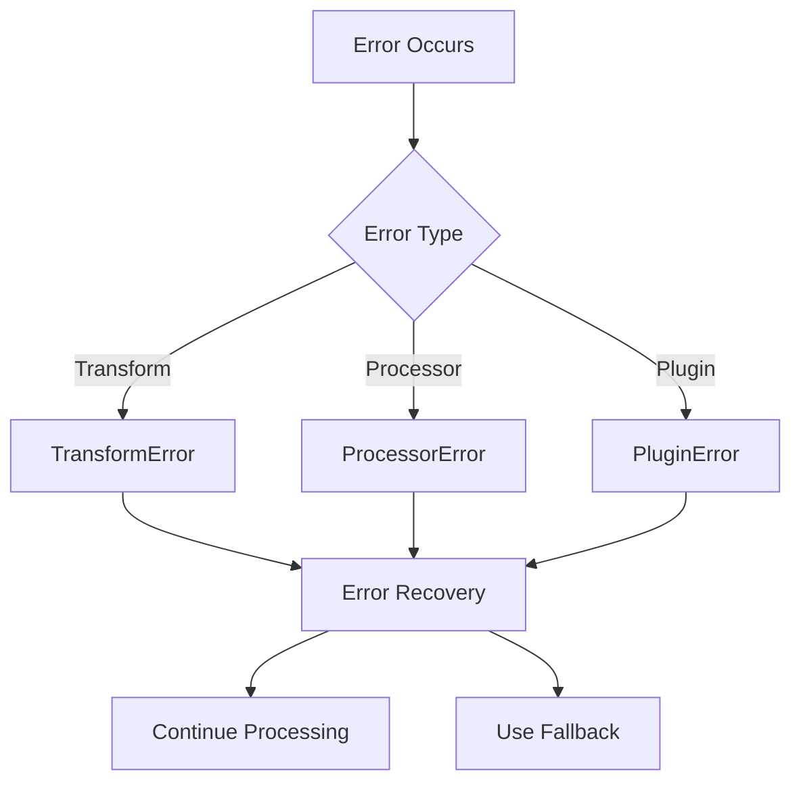

# System Patterns

## Architecture Overview

### Core Components

1. **Server Layer (Hono)**
   - REST API endpoints
   - Static file serving
   - CORS and security middleware
   - Health monitoring
   - Process endpoint for content processing

2. **Service Layer**
   - ConfigService: Configuration management
   - SubmissionService: Platform-agnostic submission handling
   - ProcessorService: Orchestrates transformation pipeline
   - TransformationService: Handles content transformations
   - DistributionService: Content distribution
   - Database Service: Data persistence with PostgreSQL and Drizzle ORM
   - PluginService: Dynamic plugin management
   - TwitterService: Twitter API interaction

3. **Plugin System**
   - Source plugins
     * Twitter (primary content source)
     * Telegram (message monitoring - planned)
     * LinkedIn (planned integration)
   - Distributor plugins
     * Telegram (@curatedotfun/telegram)
     * RSS (@curatedotfun/rss)
     * Notion (@curatedotfun/notion)
     * NEAR Social (@curatedotfun/near-social)
   - Transformer plugins
     * AI Transform (AI-powered content enhancement)
     * Simple Transform (Basic formatting)
     * Object Transform (Data mapping and transformation)
   - Plugin Features
     * Runtime loading via module federation
     * Type-safe configuration
     * Custom endpoint registration
     * Scheduled task integration
     * Development toolkit with mocks

### Database Architecture

1. **PostgreSQL with Drizzle ORM**
   - Read/write separation with connection pools
   - Transaction support with retry logic
   - Comprehensive error handling with context-rich logging
   - Default values for graceful degradation
   - Repository pattern for domain-specific database operations
   - Transaction-based operations for related data
   - Modular organization with clear separation of concerns

2. **Database Service Structure**
   - Connection management (connection.ts)
   - Transaction utilities (transaction.ts)
     * executeOperation - For single database operations
     * executeTransaction - For multi-step operations requiring atomicity
     * withDatabaseErrorHandling - For consistent error handling
   - Domain-specific repositories (repositories/)
     * Twitter repository
     * Submission repository
     * Feed repository
     * Leaderboard repository
   - Consolidated status update logic
   - Backward compatibility layer for gradual migration

3. **Development Environment**
   - Docker Compose for local development
   - PostgreSQL container with persistent volume
   - Automatic migrations on startup
   - Seed data scripts from SQLite

4. **Testing Environment**
   - Isolated test databases
   - Automated cleanup between test runs
   - Mock system for unit tests
   - Transaction rollbacks for test isolation

### Design Patterns

1. **Singleton Pattern**
   - Used in ConfigService and PluginService for global configuration
   - Ensures consistent state across the application

2. **Plugin Pattern**
   - Module federation for runtime plugin loading
   - Standardized plugin interfaces
   - Type-safe plugin configuration
   - Hot-reloading support
   - Plugin caching and invalidation

3. **Service Pattern**
   - Clear service boundaries and responsibilities
   - Platform-agnostic design
   - Encapsulated business logic
   - Dependency injection
   - Extensible action handling

4. **Observer Pattern**
   - Generic content source monitoring
   - Event-driven content processing
   - Configurable action handlers

5. **Pipeline Pattern**
   - Transformation pipeline with global and per-distributor transforms
   - Graceful error handling and recovery
   - Configurable transform chains
   - Type-safe transformation flow

## Component Relationships

### Configuration Flow

### Content Flow

```mermaid
graph LR
    Twitter[TwitterService] --> Submission[SubmissionService]
    Submission --> Moderation[Moderation]
    Moderation --> Processor[ProcessorService]
    Processor --> GlobalTransform[Global Transforms]
    GlobalTransform --> Distribution[DistributionService]
    Distribution --> DistTransform[Distributor Transforms]
    DistTransform --> Distributors[Distributor Plugins]
```

### Plugin System

### Error Handling Flow

## Key Technical Decisions

1. **PostgreSQL Database**
   - Scalable relational database
   - Read/write separation capability
   - Connection pooling for performance
   - Drizzle ORM for type-safe queries
   - Docker-based development environment

2. **Hono Framework**
   - High performance
   - Built-in TypeScript support
   - Middleware ecosystem
   - Process endpoint for content handling
   - Dynamic endpoint registration

3. **Module Federation Plugin System**
   - Runtime plugin loading without rebuilds
   - Type-safe plugin interfaces
   - Easy plugin development
   - Comprehensive testing support
   - Hot-reloading capability

4. **Configuration-Driven**
   - JSON-based configuration
   - Runtime configuration updates
   - Environment variable support
   - Extensible action handling
   - Easy forking and customization

5. **Service Architecture**
   - Platform-agnostic services
   - Clear service boundaries
   - Optimized transformer-distributor flow
   - Comprehensive testing
   - Mock system for plugin validation

6. **Error Handling**
   - Granular error types
   - Graceful degradation
   - Error recovery strategies
   - Detailed error logging
   - Error aggregation for multiple failures

7. **Task Scheduling**
   - Configuration-driven cron jobs
   - Recap generation scheduling
   - Plugin-specific scheduled tasks
   - Reliable execution tracking

8. **Build System**
   - RSPack for optimized builds
   - Module federation support
   - Fast development experience
   - Efficient bundling
   - TypeScript integration

9. **Deployment Architecture**
   - Docker containerization
   - Railway platform deployment
   - Kubernetes configuration
   - Automated CI/CD pipeline
   - Environment-specific configurations
